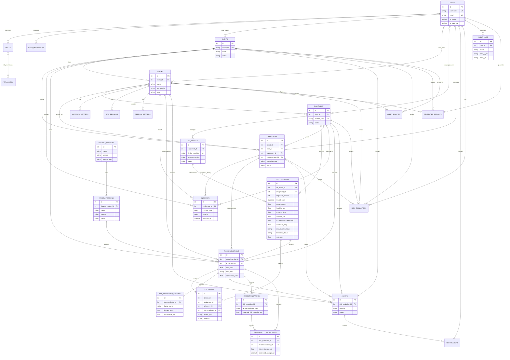

# ERD do Banco AgroGuardian AI

## Telemetria Fisica

`IOT_TELEMETRY` e o historico canonico do ESP32 fisico. `IOT_EVENTS` registra
sinais relevantes de BME280, JSN-SR04T e MPU-6050 e se relaciona a predicoes e
alertas. Nenhuma tabela `iot_sensor_readings` paralela e necessaria para o
fluxo atual.
